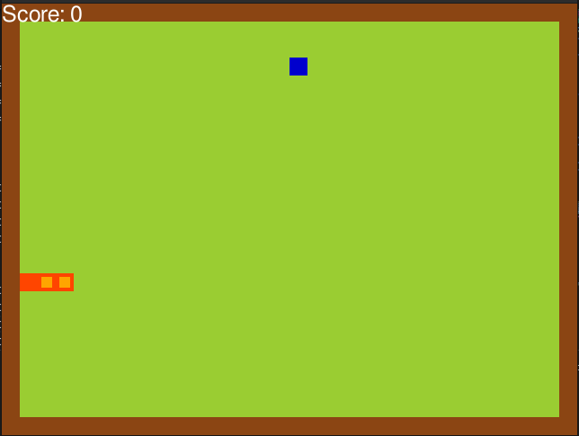
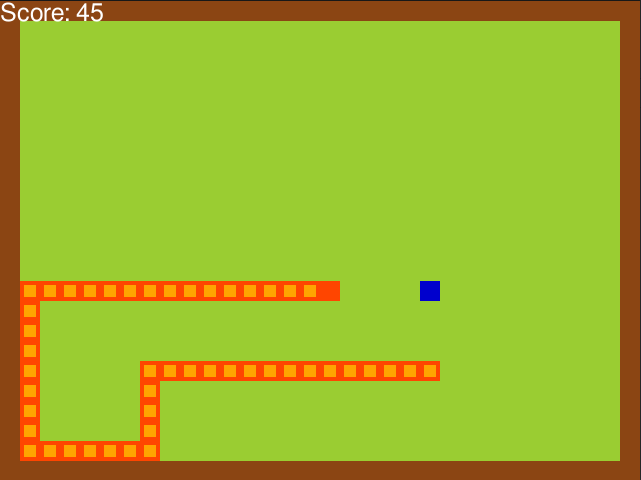

# Deep Q Learning with Snake

Deep Q learning algorithmn that plays the game of snake.

## Usage

```bash
git clone https://github.com/EteimZ/deep-Qlearning-Snake.git
pip install -r requirements.txt
python agent.py
```
Initial game



About 100 games later ...




## Project Structure

- **agent**: Contains the agent of the game.
- **game**: This environment of the game.
- **model**: This is Deep Q learning model of the game.

## Resources

Video [playlist](https://www.youtube.com/watch?v=PJl4iabBEz0&list=PLqnslRFeH2UrDh7vUmJ60YrmWd64mTTKV) by  Avatar
[Patrick Loeber](https://github.com/python-engineer)
